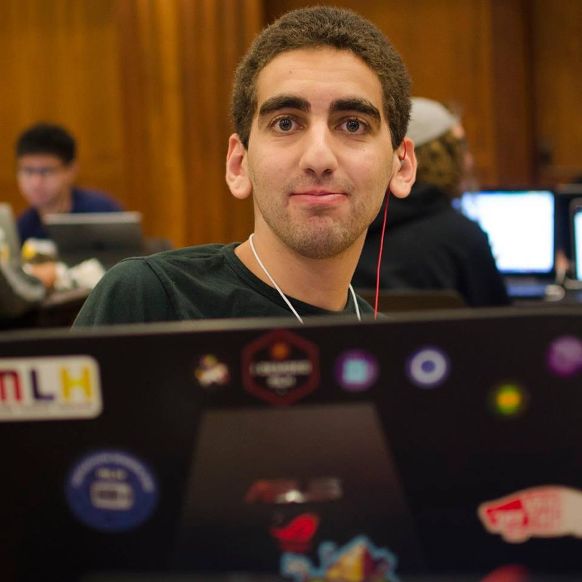

# moCYic

Our project allows you to make a mosiac of a picture using other pictures from Iowa State. We used pictures from the Iowa State Facebook page, sampled the average color and then compared all the pixels to all our sampled data in order to get the best possible result.

##Example

## Built with

We used an IDE called processing which uses Java.

## Authors

Yousef Al-Absi
Kynara Fernandes
Trevin Nance

